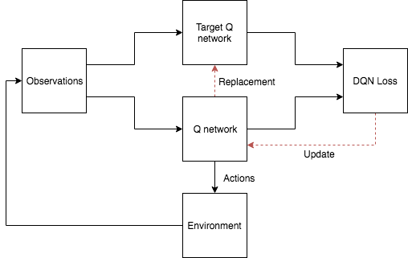

# Multi-agent DRL
Deep Reinforcement Learning in multi-agent Common Pool Resource game (CPRg), implemented using Tensorflow.

Accepted and published on *IEEE CEC 2019*.

[Paper link](https://ieeexplore.ieee.org/abstract/document/8790001/)

## Introduction

Natural renewable resources, such as groundwater, fisheries and forest resources, are depleted in a high speed world widely. These resources are called common-pool resources (CPRs). This means that any agent can access them without one another excluded.


## Prerequisite

The demo is dockerized. So all you need is [docker](https://www.docker.com/).

## Run the demo
```
./run_demo [MODEL] [N AGENT] [SUSTAINABLE WEIGHT] [LEARN MODE] [VERSION]
```

## Models
You can choose between the following models:

- `DQN`:  Deep Q-network

- `DDPG`: Deep Deterministic Policy Gradient

## Interaction  framework


## DQN Architecture



## DDPG Architecture


## Reference

1. [von der Osten F B, Kirley M, Miller T. Sustainability is possible despite greed-Exploring the nexus between profitability and sustainability in common pool resource systems[J]. Scientific reports, 2017, 7(1): 2307.](https://www.nature.com/articles/s41598-017-02151-y)
2. [Hausknecht, M., & Stone, P. (2015). Deep recurrent q-learning for partially observable mdps. CoRR, abs/1507.06527.](http://www.aaai.org/ocs/index.php/FSS/FSS15/paper/download/11673/11503)
3. [Hauser, O. P., Rand, D. G., Peysakhovich, A., & Nowak, M. A. (2014). Cooperating with the future. *Nature*, *511*(7508), 220.](https://www.researchgate.net/profile/David_Rand2/publication/263815931_Cooperating_with_the_future/links/553f5e900cf24c6a05d208d1.pdf)
4. [Mnih V, Kavukcuoglu K, Silver D, et al. Human-level control through deep reinforcement learning[J]. Nature, 2015, 518(7540): 529.](http://www.davidqiu.com:8888/research/nature14236.pdf)
5. [Kulkarni T D, Narasimhan K, Saeedi A, et al. Hierarchical deep reinforcement learning: Integrating temporal abstraction and intrinsic motivation[C]//Advances in neural information processing systems. 2016: 3675-3683.](http://papers.nips.cc/paper/6233-hierarchical-deep-reinforcement-learning-integrating-temporal-abstraction-and-intrinsic-motivation.pdf)
6. https://github.com/Ceruleanacg/Reinforcement-Learning
